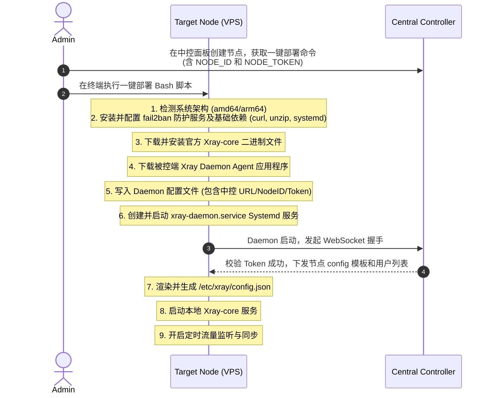

# Clash 中控 + Xray 守护进程 (被控端) 分体架构设计方案

本设计方案旨在将现有的 Clash 订阅系统重构为**分布式集群架构**。由一个**中控端 (Central Controller)** 负责用户管理、订阅下发、流量审计与配置决策；多个**被控端节点 (Xray Daemon)** 负责运行 Xray-core 实例，并通过轻量级守护进程与中控通信，实现开箱即用与动态控制。

---

## 二、 架构拓扑图 (Topology)

我们推荐使用 **被控端主动连接中控 (Pull/WebSocket Model)** 的模式。该模式下，节点服务器无需对外开放任何控制端口，安全性极高，且天然支持 NAT 内网节点。

```mermaid
graph TD
    subgraph 中控服务器 (Central Controller)
        UI[Web 管理面板] -->|操作| AdminAPI[中控控制 API / WebSocket Server]
        AdminAPI <--> DB[(关系型数据库: SQLite/MySQL)]
        ClashSub[Clash 订阅生成服务] <--> DB
    end

    subgraph 节点服务器 A (Node Server - Hong Kong)
        DaemonA[Xray Daemon Agent] <-->|双向 WebSocket / TLS| AdminAPI
        DaemonA -->|1. 写入 config.json| XrayA[Xray-core 运行实例]
        DaemonA <-->|2. 本地 gRPC 127.0.0.1:10085| XrayA
    end

    subgraph 节点服务器 B (Node Server - Japan)
        DaemonB[Xray Daemon Agent] <-->|双向 WebSocket / TLS| AdminAPI
        DaemonB -->|1. 写入 config.json| XrayB[Xray-core 运行实例]
        DaemonB <-->|2. 本地 gRPC 127.0.0.1:10085| XrayB
    end

    UserClash[用户 Clash 客户端] -->|1. 请求订阅| ClashSub
    UserClash -->|2. 代理流量| XrayA
    UserClash -->|2. 代理流量| XrayB
```

---

## 三、 核心通信与数据流向

### 1. 节点初始化阶段 (Startup & Sync)
1. **被控端 Daemon** 启动，建立与中控的 WebSocket 连接，发送身份验证 Token。
2. 验证通过后，Daemon 向中控请求 **“当前节点配置”**（包含监听端口、协议类型如 VLESS-Reality、证书密钥等）以及 **“有效用户列表”**（包含所有分配给该节点的 UUID 与 Email）。
3. Daemon 写入本地 `/etc/xray/config.json`，并启动/重启本地 Xray-core。

### 2. 动态用户同步阶段 (Real-time Management)
1. 管理员在中控 Web 面板**新增用户**（或用户充值/启用新套餐）。
2. 中控通过 WebSocket 实时向对应节点的 Daemon 发送事件：
   * `{ "event": "USER_ADD", "data": { "email": "user03@clash.sub", "uuid": "xxxx-xxxx-xxxx" } }`
3. Daemon 接收到事件，直接在本地调用 Xray 的 gRPC `AlterInbound(AddUser)`。**用户瞬间上线，无需重启 Xray，无任何断网抖动**。
4. 反之，中控发送 `USER_DEL` 事件，Daemon 调用 `AlterInbound(RemoveUser)`，用户即刻下线。

### 3. 流量审计阶段 (Traffic Reporting)
1. Daemon 内部设置定时器（例如每 1 分钟）。
2. 定时器触发后，Daemon 调用本地 Xray gRPC 的 `StatsService/QueryStats(pattern: "user>>>", reset: true)`。
3. Xray 返回这 1 分钟内每个用户消耗的 **Uplink（上传）** 和 **Downlink（下载）** 流量增量（Delta），并在本地将计数归零。
4. Daemon 将流量增量打包上传给中控 API。
5. 中控接收数据，累加至数据库对应用户的 `used_traffic` 字段中。若发现用户流量用尽，中控自动触发 `USER_DEL` 指令将该用户在所有节点上下线。

---

## 四、 节点一键部署逻辑流程 (One-Key Script Flow)

为实现被控端“开箱即用”，一键部署脚本（Bash）的设计流程如下：



---

## 五、 核心接口协议设计 (Protocol Design)

### 1. 被控端拉取节点基础配置与用户列表 (REST API / WebSocket)
**Request (Daemon -> Controller)**:
`GET /api/node/sync`
Headers: `Authorization: Bearer <NODE_TOKEN>`

**Response (Controller -> Daemon)**:
```json
{
  "node_id": 1,
  "inbounds": [
    {
      "port": 443,
      "protocol": "vless",
      "network": "tcp",
      "reality": true,
      "reality_settings": {
        "dest": "www.microsoft.com:443",
        "serverNames": ["www.microsoft.com"],
        "privateKey": "SERVER_PRIVATE_KEY",
        "shortIds": ["0123456789abcdef"]
      }
    }
  ],
  "users": [
    { "email": "user1@sub.com", "uuid": "a8c9e0d6..." },
    { "email": "user2@sub.com", "uuid": "f8d7b6a5..." }
  ]
}
```

### 2. 流量汇报协议 (Daemon -> Controller)
**WebSocket Event / HTTP POST**:
`POST /api/node/traffic`
```json
{
  "node_id": 1,
  "timestamp": 1719302400,
  "data": [
    { "email": "user1@sub.com", "uplink": 10485760, "downlink": 52428800 }, // 单位: 字节 (Byte)
    { "email": "user2@sub.com", "uplink": 204857, "downlink": 409600 }
  ]
}
```

---

## 六、 分体架构的优势

1. **极致安全**：被控端节点除了暴露给用户的代理端口（如 `443`）外，**不需要开放任何控制端口**。Daemon 与中控之间是单向建立的加密 TCP/WebSocket 连接，黑客无法探测或扫描控制通道。
2. **轻量快捷**：被控端只需要运行 Xray-core 和一个极轻量的 Go / Node.js 守护程序，内存占用极低（通常小于 30MB）。
3. **开箱即用**：管理员只需准备一台干净的服务器，粘贴中控生成的一行 Bash 命令即可全自动装好环境并上线。
4. **低延迟无感管理**：增加/删除用户全在内存中进行（gRPC），不影响服务器上正在连接的其他用户。

---

## 七、 架构细节与安全设计 (Details & Security)

### 1. WebSocket 长连接性能瓶颈评估
针对本系统的业务场景（代理中控系统），WebSocket **不会**成为性能瓶颈：
* **低连接数**：订阅分发系统的节点服务器数量通常在几个到几百个之间。在单台中控服务器上，维持几百个持续的 WebSocket 连接所消耗的 CPU 和内存几乎可以忽略不计（单个连接的内存开销通常低于 10KB）。
* **低频通信**：除了增删用户是按需即时推送外，流量和系统状态的汇报频率通常是 30 秒至 2 分钟一次。这样的低频轮询对中控的网络 I/O 没有任何压力。
* **高可用性保障措施**：
  * **心跳保活 (Heartbeat)**：每 30 秒发送 Ping/Pong 帧，检测死链并立即释放无效连接，防止产生“半打开”套接字占用系统句柄。
  * **退避重连机制 (Exponential Backoff)**：若节点因网络抖动与中控断开连接，Daemon 应该以指数退避的延迟（如 2s, 4s, 8s, 16s... 最大 60s）尝试重新连接，防止中控宕机重启时，数百个节点瞬间并发请求导致中控被 DDoS。

### 2. 节点服务器系统监控 (CPU, 内存, 带宽) 汇报
除了 Xray-core 统计的用户流量，守护进程（Daemon）应在同一个周期内收集并上报宿主服务器的系统指标：
* **数据收集方式**：
  * **Linux 环境**：可以直接读取 `/proc/stat`（CPU）、`/proc/meminfo`（内存）、`/proc/net/dev`（网卡带宽与网速）。
  * **跨平台库**：如果是 Node.js 编写的 Daemon，可以使用 `systeminformation` 库；如果是 Go，可以使用 `gopsutil` 库。
* **扩展后的流量与状态汇报协议 (`POST /api/node/report`)**：
```json
{
  "node_id": 1,
  "timestamp": 1719302400,
  "system_stats": {
    "cpu_usage": 12.5,        // CPU 使用率百分比
    "mem_usage": 45.2,        // 内存使用率百分比
    "disk_usage": 33.1,       // 磁盘空间使用率
    "load_average": [0.15, 0.08, 0.05],
    "network": {
      "rx_speed": 1245080,    // 当前实时下载速率 (Byte/s)
      "tx_speed": 8540910,    // 当前实时上传速率 (Byte/s)
      "rx_total": 458920194,  // 网卡累计接收字节数
      "tx_total": 8940582910   // 网卡累计发送字节数
    }
  },
  "user_traffic": [
    { "email": "user1@sub.com", "uplink": 10485760, "downlink": 52428800 }
  ]
}
```

### 3. 中控如何保证节点信息是合法的（节点身份与防篡改）

中控与节点的通信链路在公网上运行，必须具备以下多重安全防护机制：

#### A. 握手阶段：动态签名/令牌校验 (JWT / Shared Token)
* 节点不应该只发送一个固定的明文 Token。
* **最佳方案**：使用基于时间戳与密钥的 **HMAC-SHA256 握手签名**。
  1. 节点本地保存 `NODE_SECRET`。
  2. 建立 WebSocket 连接时，节点生成当前毫秒时间戳 `timestamp`。
  3. 计算签名：`signature = HMAC_SHA256(NODE_SECRET, node_id + timestamp)`。
  4. 连接时携带：`ws://controller.sub/api/node/ws?node_id=1&timestamp=123456&signature=xxx`。
  5. 中控用本地相同的 `NODE_SECRET` 重新计算签名，验证其一致性，并验证时间戳偏差（例如在 $\pm 5$ 秒内有效），防止**重放攻击 (Replay Attack)**。

#### B. 数据传输阶段：防消息伪造与篡改
* 如果中控只接收普通的 HTTP POST 数据，黑客可以伪造其他节点的流量数据上报。
* **防护手段**：
  * **TLS 加密传输**：中控的 WebSocket 端点必须强制使用 `wss://`（WebSocket Secure），并对 HTTP API 强制使用 `https://`。这能彻底防御中间人劫持（MITM）和嗅探。
  * **数据包 HMAC 签名**：Daemon 上传报告或拉取配置时，在 HTTP Header 或是 WebSocket 包头中附带该包数据的 Signature。中控对每一个请求包进行验签，确认包内容未被篡改。

#### C. 网络与系统安全防御
* **中控端 IP 白名单校验 (Optional)**：如果节点服务器的 IP 地址是固定的，中控数据库可以记录各节点的出口 IP。中控只允许来自该 IP 的连接请求进行 `node_id` 的认证绑定。
* **一键脚本分发安全**：一键部署脚本应通过 HTTPS 分发，防止脚本在传输中被运营商或黑客劫持并注入恶意代码。
* **Daemon 进程最小权限原则与防火墙提权**：Daemon 进程不需要 root 权限运行，只需要有读取本地文件和调用 127.0.0.1 端口的权限即可。对于需要执行的 `ufw` 命令，应通过在 `/etc/sudoers.d/xray-daemon` 中配置密码免签来提权（例如：`xray-daemon ALL=(ALL) NOPASSWD: /usr/sbin/ufw *`），保证安全隔离。Xray-core 本身也可以通过 `systemd` 配置以非 root 用户（如 `xray` 用户）运行，利用 Linux Capabilities 绑定 443 端口。
* **Fail2ban 主机防御加固**：在一键部署脚本（Root 权限）运行阶段，自动安装并启动 `fail2ban` 服务。配置默认的 SSH 监狱（Jail），设置暴破防御策略（如 5 次密码错误自动封禁 IP 24 小时），确保节点服务器的底层安全。可选地，可以增加针对 Xray 访问日志的检测规则，自动封禁恶意扫描代理端口的 IP。


---

## 八、 被控端守护进程 (Daemon) 功能规格汇总 (Daemon Feature Specifications)

根据整体分布式架构与安全自愈设计，被控端守护进程（Daemon）作为轻量级服务代理，核心功能归纳为以下四大模块：

### 1. 通信与安全模块 (Communication & Security)
* **WebSocket 加密长连接**：启动后建立与中控的加密通道（`wss://`），维持低频双向长连接。
* **数字签名鉴权**：建立连接时采用“时间戳+节点ID+密钥”的形式，在本地通过 HMAC-SHA256 计算出临时 Signature 进行握手验证，防盗用与重放攻击。
* **智能断线重连**：连接异常断开时开启指数退避机制自动重连，避免网络抖动和服务器重启时的流量风暴。
* **心跳保活**：定时发送/响应 Ping-Pong 心跳，清理无效的 TCP 半开连接。

### 2. 本地 Xray 进程及配置管理 (Xray & Config Control)
* **配置渲染与写入**：启动或中控触发全量同步时，拉取中控下发的最新配置模板，结合本地变量动态渲染成标准的 `/etc/xray/config.json`，并持久化到本地。
* **服务生命周期控制**：通过调用系统的 `systemd`（或通过程序内部子进程），对本地 `xray` 服务执行启动、停止或平滑重启操作。
* **Xray 进程保活与状态监听**：实时检测 Xray 进程的状态。若发现 Xray 意外崩溃并被拉起，Daemon 会自动触发自愈程序。
* **自动防火墙规则管理 (UFW Control)**：在中控下发配置包含新的入站端口（或动态修改端口）时，Daemon 会自动解析出监听端口与协议（如 443/tcp），检测本地 UFW 规则；如果未开启，则自动执行命令开启该端口，并使用 `comment` 写入类似 `xray-inbound: vless-tcp-in` 的备注，实现真正的开箱即用。


### 3. 用户动态生命周期管理 (Dynamic User Sync)
* **WebSocket 事件监听**：实时监听并处理中控推送的动态用户指令：
  * `USER_ADD`：解析参数并向本地 Xray 发送 gRPC 请求增加用户。
  * `USER_DEL`：发送 gRPC 请求踢除特定用户。
* **本地用户缓存 (Local In-Memory Cache)**：在 Daemon 内存中保持一份最新拉取的“当前有效用户列表”，防系统重启或网络瞬间故障。
* **实时自愈 (Self-Healing)**：
  * 检测到本地 Xray 进程重启后，Daemon 自动读取本地用户缓存，在 Xray 启动后 1 秒内通过本地 gRPC (`AlterInbound`) 重新注入所有有效用户的 UUID。
  * 重新连接上中控 WebSocket 时，主动发送 `REQ_USER_SYNC` 指令拉取最新列表更新缓存，防止离线期间发生用户数据偏差。

### 4. 数据审计与系统监控上报 (Audit & System Monitoring)
* **定时流量审计**：每隔固定周期（默认 1 分钟）调用本地 Xray gRPC 接口，执行 `QueryStats(pattern: "user>>>", reset: true)` 收集该周期内每个用户的上传/下载流量增量。
* **宿主机指标收集**：周期性采集服务器资源数据（当前 CPU 使用率、物理内存使用率、磁盘占用率、网卡实时网速）。
* **状态对账 (State Alignment)**：在每次数据包上报时，向中控发送当前内存中的 `user_count` (用户数) 和 `user_hash` (字母排序的 UUID 拼接生成的 MD5)，供中控对比审计。如果中控校验失败，则触发强制同步拉平状态。


