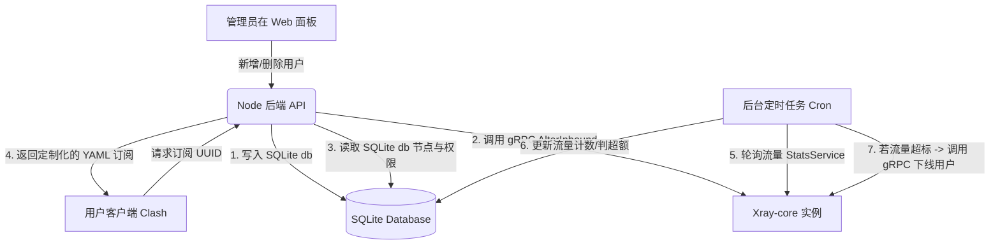

# Xray-core 深度开发与配置参考手册

本手册汇集了 Xray-core 的部署安装、配置文件详解、gRPC API 调度机制、以及如何在开发中通过 Node.js/Python 动态控制 Xray 实例，为下一步开发 Clash 订阅与 Xray 内核的联动做准备。

---

## 一、 Xray-core 部署与运维

Xray-core 是目前最为主流的高性能网络代理内核，是 V2Ray-core 的超集（拥有更快的速度、XTLS 核心协议以及更轻量化的设计）。

### 1. 官方脚本一键安装 (Linux)
官方推荐使用 `Xray-install` 维护脚本进行安装与升级。

```bash
# 安装/升级 Release 版本（包含 GeoIP 和 GeoSite 数据库）
bash -c "$(curl -L https://github.com/XTLS/Xray-install/raw/main/install-release.sh)" @ install

# 仅更新 GeoIP / GeoSite 规则文件
bash -c "$(curl -L https://github.com/XTLS/Xray-install/raw/main/install-release.sh)" @ install-geodata
```

- **二进制文件路径**: `/usr/local/bin/xray`
- **默认配置文件目录**: `/usr/local/etc/xray/` (主配置文件通常为 `config.json`)
- **规则数据库路径**: `/usr/local/share/xray/` (`geoip.dat`, `geosite.dat`)

### 2. Systemd 进程管理
一键安装脚本会自动创建 Systemd 服务，可通过标准命令进行控制：

```bash
systemctl start xray     # 启动
systemctl stop xray      # 停止
systemctl restart xray   # 重启
systemctl status xray    # 查看状态
systemctl enable xray    # 开机自启
```

*默认 Systemd 服务文件路径为 `/etc/systemd/system/xray.service`*。

### 3. Docker 容器部署
若需要容器化部署，可使用官方或社区维护的高质镜像（如 `teddysun/xray` 或 `ghostry/xray`），通过 Docker Compose 进行快捷编排：

`docker-compose.yml` 示例：
```yaml
version: '3'
services:
  xray:
    image: teddysun/xray:latest
    container_name: xray-core
    restart: always
    network_mode: "host"  # 推荐使用 host 网络模式，方便直接监听 API 端口及代理端口
    volumes:
      - ./config.json:/etc/xray/config.json
      - ./geodata:/usr/share/xray
    logging:
      driver: "json-file"
      options:
        max-size: "10m"
        max-file: "3"
```

---

## 二、 配置文件结构与核心协议 (config.json)

Xray 使用 JSON 格式进行配置。典型的配置包含 `log`（日志）、`api`（管理API）、`stats`（流量统计）、`policy`（本地策略）、`inbounds`（入站代理）、`outbounds`（出站代理）、`routing`（路由）这几个核心板块。

### 1. VLESS + XTLS Reality + gRPC 典型服务端配置
以下是一个**合一**配置模版：开启了 **VLESS-Reality (gRPC 传输)** 入站协议，并启用了**流量统计与 gRPC 控制 API**。

```json
{
  "log": {
    "loglevel": "info",
    "access": "/var/log/xray/access.log",
    "error": "/var/log/xray/error.log"
  },
  "api": {
    "tag": "api",
    "services": [
      "HandlerService",
      "StatsService",
      "RoutingService",
      "LoggerService"
    ]
  },
  "stats": {},
  "policy": {
    "levels": {
      "0": {
        "statsUserUplink": true,
        "statsUserDownlink": true
      }
    },
    "system": {
      "statsInboundUplink": true,
      "statsInboundDownlink": true,
      "statsOutboundUplink": true,
      "statsOutboundDownlink": true
    }
  },
  "inbounds": [
    // 1. 核心代理业务入站: VLESS + REALITY + gRPC
    {
      "port": 443,
      "protocol": "vless",
      "tag": "vless-reality-in",
      "settings": {
        "clients": [
          {
            "id": "e0d63503-4927-4c3e-8c33-c28f118ee6a9", // 用户UUID
            "flow": "",                                  // gRPC模式下 flow 必须为空，TCP-Vision模式下填写 xtls-rprx-vision
            "email": "user01@clash.sub"                  // 必须配置 email，流量统计 API 将以它为标识
          }
        ],
        "decryption": "none"
      },
      "streamSettings": {
        "network": "grpc",
        "security": "reality",
        "grpcSettings": {
          "serviceName": "xray-grpc-stream"              // gRPC 服务名称，客户端需保持一致
        },
        "realitySettings": {
          "show": false,
          "dest": "www.microsoft.com:443",               // 目标混淆网站
          "serverNames": ["www.microsoft.com"],
          "privateKey": "YOUR_SERVER_PRIVATE_KEY",       // 服务端私钥 (通过 xray x25519 生成)
          "shortIds": ["0123456789abcdef"]               // 混淆 shortId
        }
      }
    },
    // 2. 本地管理 API 入站: dokodemo-door (仅允许本地回环访问)
    {
      "listen": "127.0.0.1",
      "port": 10085,
      "protocol": "dokodemo-door",
      "settings": {
        "address": "127.0.0.1"
      },
      "tag": "api-in"
    }
  ],
  "outbounds": [
    {
      "protocol": "freedom",
      "tag": "direct"
    },
    {
      "protocol": "blackhole",
      "tag": "blocked"
    }
  ],
  "routing": {
    "rules": [
      // 必须配置：将管理 API 入站流量路由到 API 处理器
      {
        "inboundTag": ["api-in"],
        "outboundTag": "api",
        "type": "field"
      },
      // 屏蔽广告或私有网络路由规则 (可选)
      {
        "outboundTag": "blocked",
        "geoip": ["private"],
        "type": "field"
      }
    ]
  }
}
```

### 2. REALITY 证书密钥生成
执行以下命令生成 Reality 专属的密钥对：
```bash
xray x25519
```
输出示例：
```text
Private key:  uLxxxxxxxxxxxxxxxxxxxxxxxxxxxxxxxxxxxxx=  (填入服务端 config.json 的 privateKey)
Public key:   2Rxxxxxxxxxxxxxxxxxxxxxxxxxxxxxxxxxxxxx=  (填入客户端订阅节点的 publicKey)
```

---

## 三、 Xray gRPC 管理 API 调度详解

Xray 内核暴露出 gRPC 接口，使开发者能够在**不重启服务**的情况下，实现用户动态上线、下线、流量查询与重置。

### 1. 核心服务 (Services) 及其接口说明

| 服务类名 (gRPC Service) | 方法名 (Methods) | 功能说明 |
| :--- | :--- | :--- |
| **`xray.app.proxyman.command.HandlerService`** | `AlterInbound` | 动态修改入站配置（**核心：用于添加/删除用户**） |
| | `AddInbound` / `RemoveInbound` | 动态增加或删除整个入站端口（如动态开端口） |
| | `AlterOutbound` / `AddOutbound` | 动态修改/添加出站代理节点 |
| **`xray.app.stats.command.StatsService`** | `GetStats` | 获取单条统计项（如指定用户、入站、出站的上传/下载流量） |
| | `QueryStats` | 根据正则表达式模式批量查询流量，并可选择是否**在查询后清空（重置）计数** |
| | `GetSysStats` | 获取系统运行状态（Goroutine 数、内存分配、运行时间） |
| **`xray.app.router.command.RoutingService`**| `AddRule` / `RemoveRule` | 动态增加或删除路由规则 |

### 2. 使用命令行工具 `grpcurl` 进行快速调试
在服务器本地，可以使用 `grpcurl`（Go 编写的 gRPC 命令行客户端）来直接调度 Xray API。

#### A. 列出所有可用的 gRPC 服务
```bash
grpcurl -plaintext 127.0.0.1:10085 list
```

#### B. 动态添加一个用户 (以 VLESS 为例)
调用 `AlterInbound` 接口，向 `vless-reality-in` 入站内动态添加一个客户端用户：
```bash
grpcurl -plaintext -d '{
  "tag": "vless-reality-in",
  "operation": {
    "@type": "type.googleapis.com/xray.app.proxyman.command.AddUserOperation",
    "user": {
      "email": "dynamic_user_02@clash.sub",
      "level": 0,
      "account": {
        "@type": "type.googleapis.com/xray.proxy.vless.Account",
        "id": "a34c8928-1111-2222-3333-d8c9735411ff"
      }
    }
  }
}' 127.0.0.1:10085 xray.app.proxyman.command.HandlerService/AlterInbound
```

#### C. 动态删除一个用户
```bash
grpcurl -plaintext -d '{
  "tag": "vless-reality-in",
  "operation": {
    "@type": "type.googleapis.com/xray.app.proxyman.command.RemoveUserOperation",
    "email": "dynamic_user_02@clash.sub"
  }
}' 127.0.0.1:10085 xray.app.proxyman.command.HandlerService/AlterInbound
```

#### D. 查询指定用户的累积流量
Xray 在开启 `policy` 中的 `statsUserUplink`/`statsUserDownlink` 后，会自动累计流量，命名规则为 `user>>>[email]>>>uplink` 和 `user>>>[email]>>>downlink`：
```bash
# 查询上传流量
grpcurl -plaintext -d '{
  "name": "user>>>dynamic_user_02@clash.sub>>>uplink",
  "reset": false
}' 127.0.0.1:10085 xray.app.stats.command.StatsService/GetStats
```

#### E. 模糊查询所有用户流量并重置（用于月结或周期计费）
```bash
# 查询所有用户的流量统计值，reset: true 将在返回当前数值后，把数据库中对应的计数器归零
grpcurl -plaintext -d '{
  "pattern": "user>>>",
  "reset": true
}' 127.0.0.1:10085 xray.app.stats.command.StatsService/QueryStats
```

---

## 四、 编程语言集成与调度 (Node.js & Python 示例)

在 Clash 订阅管理系统的二次开发中，我们通常需要在后端（例如当前项目的 `backend/` 目录）直接用代码操作 Xray API。

### 1. Node.js (基于 `@grpc/grpc-js` 与 `@grpc/proto-loader`)

#### 安装依赖包
```bash
npm install @grpc/grpc-js @grpc/proto-loader
```

#### Node.js 实现动态添加用户与查询流量代码示例
在使用前，需要从 [Xray-core Repository](https://github.com/XTLS/Xray-core/tree/main) 下载对应的 `.proto` 结构定义文件并存放在本地，例如放入 `backend/protos/` 文件夹中。

```javascript
const path = require('path');
const grpc = require('@grpc/grpc-js');
const protoLoader = require('@grpc/proto-loader');

// 配置 Proto 文件的包含路径（由于 Xray 内部 proto 文件有相互 import，需传入 includeDirs）
const PROTO_ROOT = path.join(__dirname, 'protos');
const PROXYMAN_PROTO = path.join(PROTO_ROOT, 'app/proxyman/command/command.proto');
const STATS_PROTO = path.join(PROTO_ROOT, 'app/stats/command/command.proto');

// 1. 加载 Proxyman 服务定义
const proxymanDef = protoLoader.loadSync(PROXYMAN_PROTO, {
  keepCase: true,
  longs: String,
  enums: String,
  defaults: true,
  oneofs: true,
  includeDirs: [PROTO_ROOT]
});
// 2. 加载 Stats 服务定义
const statsDef = protoLoader.loadSync(STATS_PROTO, {
  keepCase: true,
  longs: String,
  enums: String,
  defaults: true,
  oneofs: true,
  includeDirs: [PROTO_ROOT]
});

const xrayProto = grpc.loadPackageDefinition(proxymanDef).xray;
const xrayStatsProto = grpc.loadPackageDefinition(statsDef).xray;

// 建立连接客户端
const handlerClient = new xrayProto.app.proxyman.command.HandlerService(
  '127.0.0.1:10085',
  grpc.credentials.createInsecure()
);

const statsClient = new xrayStatsProto.app.stats.command.StatsService(
  '127.0.0.1:10085',
  grpc.credentials.createInsecure()
);

/**
 * 动态向指定的 Inbound 添加用户
 * @param {string} inboundTag - 入站 Tag (例如 "vless-reality-in")
 * @param {string} email - 用户唯一邮箱标识（流量统计键值）
 * @param {string} uuid - VLESS / VMess 用户 UUID
 */
function addXrayUser(inboundTag, email, uuid) {
  // 构建 VLESS 协议的账号序列化载荷
  // 注意: 不同协议对应的 account 结构不同，此处以 vless.Account 为例
  const accountTypeUrl = "type.googleapis.com/xray.proxy.vless.Account";
  const accountPayload = Buffer.from(JSON.stringify({ id: uuid }));

  const request = {
    tag: inboundTag,
    operation: {
      type_url: "type.googleapis.com/xray.app.proxyman.command.AddUserOperation",
      value: Buffer.from(JSON.stringify({
        user: {
          level: 0,
          email: email,
          account: {
            type_url: accountTypeUrl,
            value: accountPayload
          }
        }
      }))
    }
  };

  handlerClient.AlterInbound(request, (err, response) => {
    if (err) {
      console.error(`[-] 动态添加用户失败: ${err.message}`);
    } else {
      console.log(`[+] 成功向 ${inboundTag} 添加用户 [${email}]`);
    }
  });
}

/**
 * 查询用户上传和下载流量
 * @param {string} email 
 */
function queryUserTraffic(email) {
  const queryPattern = `user>>>${email}>>>`;
  statsClient.QueryStats({ pattern: queryPattern, reset: false }, (err, response) => {
    if (err) {
      console.error(`[-] 查询流量失败: ${err.message}`);
      return;
    }
    
    let uplink = 0;
    let downlink = 0;
    if (response && response.stat) {
      response.stat.forEach(item => {
        if (item.name.endsWith('uplink')) {
          uplink = parseInt(item.value);
        } else if (item.name.endsWith('downlink')) {
          downlink = parseInt(item.value);
        }
      });
    }
    console.log(`[*] 用户 [${email}] 流量数据:`);
    console.log(`    上传: ${(uplink / 1024 / 1024).toFixed(2)} MB`);
    console.log(`    下载: ${(downlink / 1024 / 1024).toFixed(2)} MB`);
    console.log(`    总量: ${((uplink + downlink) / 1024 / 1024).toFixed(2)} MB`);
  });
}

// 导出模块供 Express 路由调用
module.exports = {
  addXrayUser,
  queryUserTraffic
};
```

---

## 五、 后续开发联动架构设计建议

在将 Xray-core 的 API 整合进目前基于 SQLite 的 Clash 订阅管理系统（当前工程）时，推荐采用以下业务链路：



1. **强一致性同步**: 所有的动态修改操作（增删改用户）应当采用 **双写** 策略。即先写入当前项目的本地 SQLite 数据库中，然后直接调用 gRPC API 发送指令给正在运行的 Xray-core 实例。
2. **流量看门狗 (Daemon)**: 在后端服务中启动一个轻量级的周期定时任务（如每隔 5 分钟执行一次），通过 `QueryStats` 查询所有用户的最新流量。累加到 SQLite 数据库的用户信息表，并检查用户总流量是否超出额度。若超额，则通过 gRPC API 的 `RemoveUserOperation` 瞬时将其断网，实现全自动流量计费与控制。
3. **节点订阅下发**: 用户的 UUID 对应一条加密的订阅链接。后端 Express 路由解析到 UUID 后，检查数据库中的可用节点列表及套餐状态，动态生成 Clash 配置 YAML 文件下发，其中包含 Reality / vless 协议所需要的所有传输参数（如 TLS / grpc-serviceName / Reality PublicKey）。
